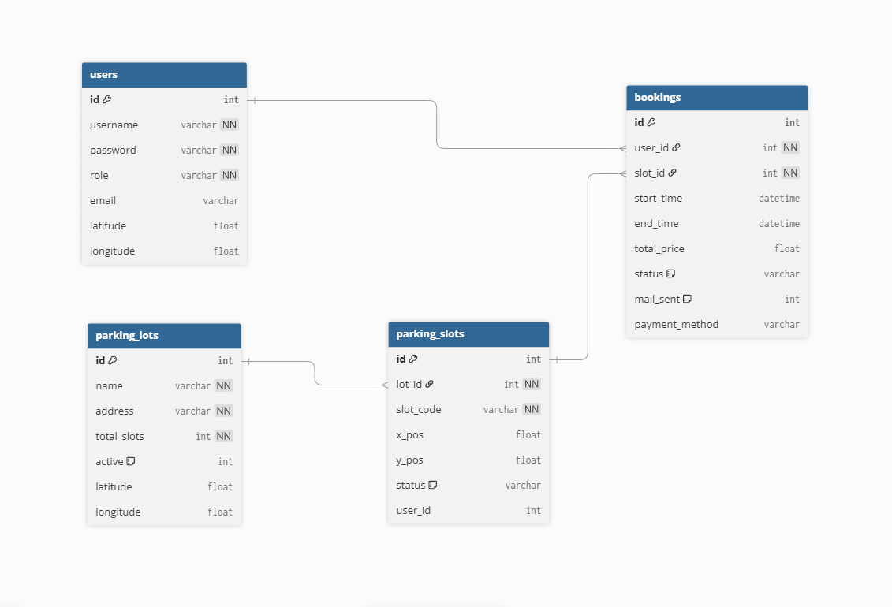

# 🚗 Smart Parking System (SPS)

Smart Parking System là ứng dụng Desktop giúp quản lý và đặt chỗ đỗ xe thông minh, được phát triển bằng **Java + JavaFX**.  
Hệ thống cung cấp bản đồ trực quan, đặt chỗ theo thời gian thực và cơ chế tự động vận hành bằng Background Scheduler.

---

## 📌 1. Tổng quan

Hệ thống giải quyết bài toán tìm và quản lý chỗ đỗ xe tại khu vực đô thị:

- Tìm bãi xe gần nhất theo địa chỉ
- Hiển thị sơ đồ bãi xe trực quan (Live Map)
- Đặt chỗ và thanh toán theo thời gian
- Tự động giải phóng chỗ khi hết giờ
- Gửi email thông báo cho người dùng

---

## 🛠 2. Công nghệ sử dụng

- **Java 17**
- **JavaFX (FXML)**
- **SQLite**
- **Maven**
- **OpenStreetMap (Nominatim API)** – Geocoding
- **Jakarta Mail API** – Gửi email
- **Multithreading**
  - `ScheduledExecutorService` – Scheduler nền
  - `Platform.runLater()` & `Timeline` – Cập nhật UI an toàn

---

## 🛰 3. Thiết kế cơ sở dữ liệu (ERD)

Hệ thống sử dụng mô hình cơ sở dữ liệu quan hệ để đảm bảo tính nhất quán và hiệu năng.

### Các bảng chính

- **users** – Thông tin người dùng và vai trò
- **parking_lots** – Danh sách bãi xe và vị trí địa lý
- **parking_slots** – Vị trí từng ô trên bản đồ (x, y) và trạng thái
- **bookings** – Lịch sử đặt chỗ, thời gian và thanh toán

### Quan hệ

- users 1 — n bookings  
- parking_lots 1 — n parking_slots  
- parking_slots 1 — n bookings  

### Sơ đồ ERD

---

## 🌟 4. Tính năng nổi bật

### Người dùng
- Live Map (Xanh: Trống | Đỏ: Đã đặt | Vàng: Bảo trì)
- Countdown thời gian đỗ xe theo thời gian thực
- Lịch sử đặt chỗ
- Tìm bãi xe gần nhất theo địa chỉ

### Quản trị viên
- Drag & Drop bố trí sơ đồ bãi xe
- Thêm/Xóa ô đỗ
- Thống kê doanh thu (BarChart)
- Quản lý toàn bộ đơn đặt

---

## ⚙️ 5. Cơ chế tự động (Scheduler)

Một luồng nền chạy mỗi **30 giây**:

- Kiểm tra booking hết hạn
- Tự động cập nhật slot → EMPTY
- Gửi email thông báo
- Timeline trên UI tự động cập nhật trạng thái

---

## 📂 6. Cấu trúc project
org.example.api // OpenStreetMap API
org.example.controller // JavaFX Controllers
org.example.dao // Database layer
org.example.service // Business logic
org.example.scheduler // Background Scheduler
org.example.session // User session (Singleton)